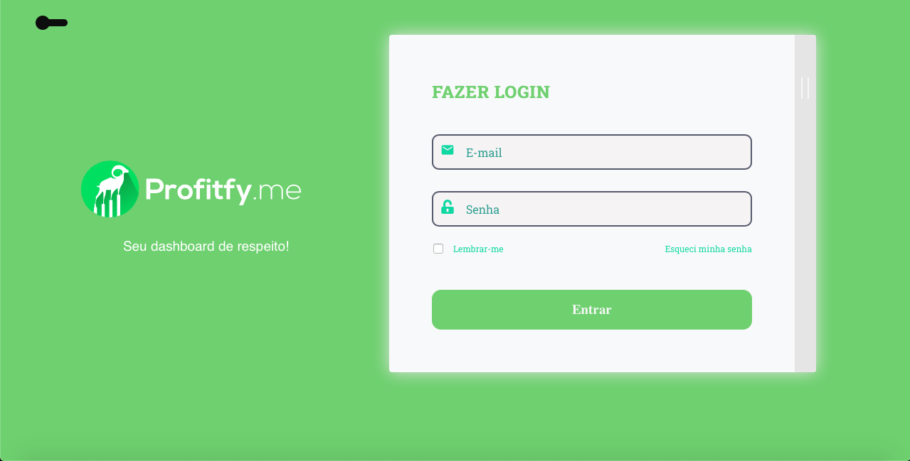
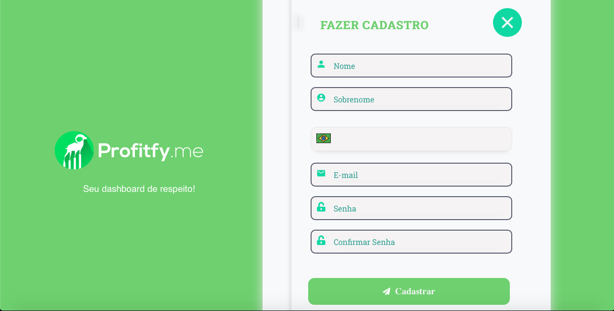

<h1 align="center">
  
</h1>
<h1>:iphone: Interface Web</h1>
<br/>
<h1 align="center">
  
</h1>

</br>

<h1>:handbag: Monorepo</h1>
 
Este monorepo tem como objetivo armazenar o desenvolvimento de uma aplicação fullstack sendo 
composto por um servidor desenvolvido com NodeJs e uma interface web, sendo esta desenvolvida 
com ReactJS. Ambos os componentes que compôe da aplicação foram desenvolvidos com TypeScript 
como base.

</br>

> ## :key: Scripts

* yarn dev:server => (niciar o servidor)
* yarn dev:web => (iniciar a aplicação web)

</br>

> ## :rocket: Tecnologias

- [Husky](https://github.com/typicode/husky)
- [Travis CI](https://github.com/travis-ci/travis-ci)
- [Commitizen](https://github.com/commitizen/cz-cli)
- [commitlint](https://github.com/conventional-changelog/commitlint)
- [Lint Staged](https://github.com/okonet/lint-staged)
- [Eslint](https://github.com/eslint/eslint)

</br>

<h1>:earth_americas: Backend</h1>

<h3 align="center">
  Repositório com o Servidor (Backend) & Web-Application (Frontend) do projeto fullstack Profitify.me
</h3>

<p align="center">
  

  <a href="https://www.linkedin.com/in/vinicius-prudencio-64bb99128/" target="_blank" rel="noopener noreferrer">
    
  </a>

  

  <a href="https://github.com/vynnydev/profitify-server/commits/dev">
    
  </a>

  <a href="https://img.shields.io/github/issues/vynnydev/profitfy-server?color=yellow">
    
  </a>

  
</p>

<p align="center">
  <a href="#%EF%B8%8F-about-the-project">About the project</a>&nbsp;&nbsp;&nbsp;|&nbsp;&nbsp;&nbsp;
  <a href="#-technologies">User Cases</a>&nbsp;&nbsp;&nbsp;|&nbsp;&nbsp;&nbsp;
  <a href="#-technologies">Estrutura do Projeto</a>&nbsp;&nbsp;&nbsp;|&nbsp;&nbsp;&nbsp;
  <a href="#-technologies">Princípios</a>&nbsp;&nbsp;&nbsp;|&nbsp;&nbsp;&nbsp;
  <a href="#-technologies">Tecnologias</a>&nbsp;&nbsp;&nbsp;|&nbsp;&nbsp;&nbsp;
  <a href="#-technologies">Princípais Features</a>&nbsp;&nbsp;&nbsp;|&nbsp;&nbsp;&nbsp;
  <a href="#-getting-started">Getting started</a>&nbsp;&nbsp;&nbsp;|&nbsp;&nbsp;&nbsp;
  <a href="#-getting-started">Rotas da Aplicação</a>&nbsp;&nbsp;&nbsp;|&nbsp;&nbsp;&nbsp;
  <a href="#-getting-started">URL no Heroku</a>&nbsp;&nbsp;&nbsp;|&nbsp;&nbsp;&nbsp;
  <a href="#-license">License</a>
</p>

</br>

> ## :warning: Observação!

<p>Veja abaixo, dentro do acesso a cada módulo do projeto dentro de sua respectiva sessão, sendo Backend & Frontend</p>

</br>

> ## :bar_chart: About the project

Está API serve o frontent desenvolvido com ReactJS, foi projetado para gerenciamento de finanças e outras 
tarefas por meio de um dashboard, mas inicialmente somente desenvolvido o Login e SignUp com Typescript, 
NodeJs, Express, JWT, Postgres, ReactJS, Clean Architecture, CD/CI usando Travis, Docker & Heroku.

</br>

> ## :high_brightness: User Cases

1. [SignUp](./requirements/signup.md)
2. [Login](./requirements/login.md)

</br>

> ## :wrench: Estrutura do projeto
```bash
* src
  - data => (Onde se encontram as classes que tratam a regra de negócio com o banco de dados)
  - domain => (Onde se encontra a regra de negócio) 
  - infra => (Onde se encontram as implementações das regras de negócio) 
  - main => (Onde se encontram as features servidoras e principais)
  - presentation => (Camada de apresentação da regra de negócio)
  - validation => (Onde se encontram as validações de erros e demais validações)
```

</br>


> ## :key: Scripts

* yarn build => (constroí e transpila com babel)
* yarn start => (inicia a aplicação) 
* yarn typeorm => (constroí comandos do typeorm) 
* yarn debug => (debuga a aplicação)
* yarn dev:server => (inicia o servidor no modo de desenvolvimento)
* yarn resetDatabase => (apaga as migrações com typeorm)
* yarn db:migrate => (reseta as migrações com typeorm)
* yarn migration:run => (faz as migrações)
* yarn lint => (checa erros com eslint)
* yarn lint:fix => (corrige os erros com eslint)
* yarn style:check => (checa os erros com prettier)
* yarn style:fix => (corrige os erros com prettier)
* yarn test => (executa os testes com jest)
* yarn test:verbose => (verifica todos os testes gerando um grafico)
* yarn test:unit => (executa os testes de unidade)
* yarn test:integration => (executa os testes de integração)
* yarn test:staged => (executa os testes em commit)
* yarn test:ci => (executa os testes e gera uma tabela na pasta coverage)
* yarn test:coveralls => (executa os testes, gera uma tabela e executa o ci)

</br>

> ## :construction: Princípios
```bash
## SOLID
  * Single Responsibility Principle (SRP)
  * Open Closed Principle (OCP)
  * Liskov Substitution Principle (LSP)
  * Interface Segregation Principle (ISP)
  * Dependency Inversion Principle (DIP)
  * Separation of Concerns (SOC)
  * Don't Repeat Yourself (DRY)
  * You Aren't Gonna Need It (YAGNI)
  * Keep It Simple, Silly (KISS)
  * Small Commits

## Design 
  * Factory
  * Dependency Injection
```

</br>

> ## :beginner: Metodologias e Designs
```bash
  * TDD (Test Driven Development)
  * DDD (Domain Driven Development) e algumas praticas de Clean Architecture
  * Conventional Commits
  * GitHub
  * Use Cases
  * Continuous Integration
  * Continuous Delivery
  * Continuous Deployment
```

</br>

> ## :rocket: Tecnologias

- [Yarn](https://github.com/yarnpkg/yarn)
- [TypeScript](https://github.com/microsoft/TypeScript)
- [Git](https://github.com/git/git)
- [Docker](https://github.com/docker)
- [TypeORM](https://github.com/typeorm/typeorm)
- [Jest](https://github.com/facebook/jest)
- [Postgres](https://github.com/postgres/postgres)
- [Travis CI](https://github.com/travis-ci/travis-ci)
- [BcryptJs](https://github.com/dcodeIO/bcrypt.js/)
- [JsonWebToken](https://github.com/jsonwebtoken/jsonwebtoken.github.io)
- [FakerJs](https://github.com/marak/Faker.js/)
- [Coveralls](https://github.com/marketplace/coveralls)
- [Validator](https://github.com/express-validator/express-validator)
- [Express](https://github.com/expressjs/express)
- [Supertest](https://github.com/visionmedia/supertest)
- [Husky](https://github.com/typicode/husky)
- [Lint Staged](https://github.com/okonet/lint-staged)
- [Eslint](https://github.com/eslint/eslint)
- [Nodemon](https://github.com/remy/nodemon)
- [Rimraf](https://github.com/isaacs/rimraf)
- [Husky](https://github.com/typicode/husky)- 
- [MockDate](https://github.com/boblauer/MockDate)
- [Module-Alias](https://github.com/ilearnio/module-alias)
- [Morgan](https://github.com/expressjs/morgan)
- [Commitizen](https://github.com/commitizen/cz-cli)
- [commitlint](https://github.com/conventional-changelog/commitlint)
- [Babel](https://github.com/babel/babel)
- [editorconfig](https://github.com/editorconfig/editorconfig-vscode)
- [dotenv](https://github.com/motdotla/dotenv)

</br>

> ## :hammer: Princípais Features
```bash
## Features do Node
  * Documentação de API com Swagger
  * Log de Erro
  * Segurança (Hashing, Encryption e Encoding)
  * CORS
  * Deploy no Heroku

## Features do Typescript
  * POO Avançado
  * Interface
  * TypeAlias
  * Utility Types
  * Modularização de Paths
  * Build
  * Deploy
  * Uso de Breakpoints

## Features do PostgreSQL & TypeORM
  * create, find, findByEmail & findOne

## Features de Testes
  * Testes Unitários
  * Fakes
```

</br>

> ## :key: Getting Started
**Follow the steps below**
```bash
  # Instale as dependencias
  $ yarn install

  # Faça uma cópia de '.env.example' para '.env'
  # e configure com suas variáveis de ambiente.
  $ cp .env.example .env

  # Inicie os serviços com docker-compor
  # ** O script 'init.sh' dentro do docker
  # já faz as migrações **
  $ docker-compose up -d

  # Bem feito, projeto está iniciado!
```

</br>

> ## Rotas da Aplicação
```bash
  # Criar uma conta => /account/create
  # Se logar na aplicação => /session
```

</br>

---

<h1>:desktop_computer: Frontend</h1>
<h3 align="center">
  Aplicação Profitfy.me usando ReactJS & TypeScript 
</h3>

<p align="center">Profitfy.me - Seu Dashboard de respeito!</p>

<p align="center">
  

  <a href="https://www.linkedin.com/in/vinicius-prudencio-64bb99128/" target="_blank" rel="noopener noreferrer">
    
  </a>

  

  <a href="https://github.com/vynnydev/profitfyme-web/commits/dev">
    
  </a>

  <a href="https://img.shields.io/github/issues/vynnydev/profitfyme-web?color=yellow">
    
  </a>

  
</p>

<p align="center">
  <a href="#%EF%B8%8F-about-the-project">About the project</a>&nbsp;&nbsp;&nbsp;|&nbsp;&nbsp;&nbsp;
  <a href="#-technologies">Interfaces</a>&nbsp;&nbsp;&nbsp;|&nbsp;&nbsp;&nbsp;
  <a href="#-technologies">User Cases</a>&nbsp;&nbsp;&nbsp;|&nbsp;&nbsp;&nbsp;
  <a href="#-technologies">Estrutura do Projeto</a>&nbsp;&nbsp;&nbsp;|&nbsp;&nbsp;&nbsp;
  <a href="#-technologies">Princípios</a>&nbsp;&nbsp;&nbsp;|&nbsp;&nbsp;&nbsp;
  <a href="#-technologies">Tecnologias</a>&nbsp;&nbsp;&nbsp;|&nbsp;&nbsp;&nbsp;
  <a href="#-technologies">Princípais Features</a>&nbsp;&nbsp;&nbsp;|&nbsp;&nbsp;&nbsp;
  <a href="#-getting-started">Getting started</a>&nbsp;&nbsp;&nbsp;|&nbsp;&nbsp;&nbsp;
  <a href="#-getting-started">Rotas da Aplicação</a>&nbsp;&nbsp;&nbsp;|&nbsp;&nbsp;&nbsp;
  <a href="#-getting-started">URL no Heroku</a>&nbsp;&nbsp;&nbsp;|&nbsp;&nbsp;&nbsp;
  <a href="#-license">License</a>
</p>

</br>

> ## :desktop_computer: About the project

Está aplicação frontent desenvolvido com ReactJS, foi projetado para gerenciamento de finanças e
outras tarefas por meio de um dashboard, mas inicialmente foi somente desenvolvido o Login e SignUp com Typescript,
NodeJs, Express, JWT, Postgres, ReactJS, Clean Architecture, CD/CI usando Travis, Docker & Heroku.

</br>

> ## :bar_chart: Interfaces 

<p align="center">
  
</p>
<p align="center">
  
</p>

</br>

> ## :high_brightness: User Cases

1. [SignUp](./requirements/signup.md)
2. [Login](./requirements/login.md)

</br>

> ## :key: Scripts

 * yarn start => (inicia a aplicação web)
 * yarn build => (faz o build da aplicação)
 * yarn test => (executa testes de aplicação "Está aplicação frontend não possui testes com Jest")
 * yarn eject => (ejeta o create-react-app)
 * yarn lint => (verifica os erros com eslint)
 * yarn lint:fix => (corrige os erros com eslint)
 * yarn style:check => (verifica os erros com prettier)
 * yarn style:fix => (corrige os erros com prettier)
 * yarn check:updates => (verifica update de pacotes com o yarn)

</br>

> ## :hammer: Estrutura do projeto
```bash
* src
  - infra => (Onde se encontra a ligação com o servidor & banco de dados)
  - main => (Onde se encontram as rotas da aplicação)
  - presentation => (Onde se encontram os componentes de apresentação da aplicação)
  - validation => (Onde se encontram as validações de erros e do Yup)
```

</br>

> ## :construction: Metodologias e Designs
```bash
  * TDD (Test Driven Development)
  * DDD (Domain Driven Development) e algumas praticas de Clean Architecture
  * Conventional Commits
  * GitHub
  * Use Cases
  * Continuous Integration
  * Continuous Delivery
  * Continuous Deployment
```

</br>

> ## :rocket: Tecnologias

- [ReactJS](https://reactjs.org/)
- [TypeScript](https://www.typescriptlang.org/)
- [Yarn](https://github.com/yarnpkg/yarn)
- [Git](https://github.com/git/git)
- [Travis CI](https://github.com/travis-ci/travis-ci)
- [React Router DOM](https://reacttraining.com/react-router/)
- [React Icons](https://react-icons.netlify.com/#/)
- [UnForm](https://unform.dev/) [💜](https://rocketseat.com.br/)
- [Yup](https://github.com/jquense/yup)
- [Styled Components](https://styled-components.com/)
- [Polished](https://github.com/styled-components/polished)
- [Axios](https://github.com/axios/axios)
- [Husky](https://github.com/typicode/husky)
- [Commitlint](https://github.com/conventional-changelog/commitlint)
- [Commitizen](https://github.com/commitizen/cz-cli)
- [Eslint](https://eslint.org/)
- [Prettier](https://prettier.io/)
- [EditorConfig](https://editorconfig.org/)

</br>

> ## :hammer: Princípais Features
```bash
## Features do React
  * Deploy no Heroku

## Features do Typescript
  * POO Avançado
  * Interface
  * Deploy
```

</br>

> ## :key: Getting Started
**Follow the steps below**
```bash
  # Instale as dependencias
  $ yarn install

  # Inicie os serviços com yarn start
  $ yarn start

  # Bem feito, projeto está iniciado!
```


## 📝 License

This project is licensed under the MIT License - see the [LICENSE](LICENSE) file for details.

---

Made with 💜 by Vinicius Prudencio 👋 [See my linkedin](https://www.linkedin.com/in/vinicius-prudencio-64bb99128/)
